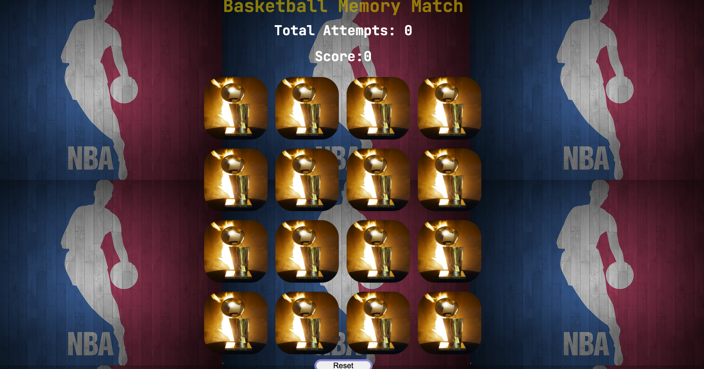
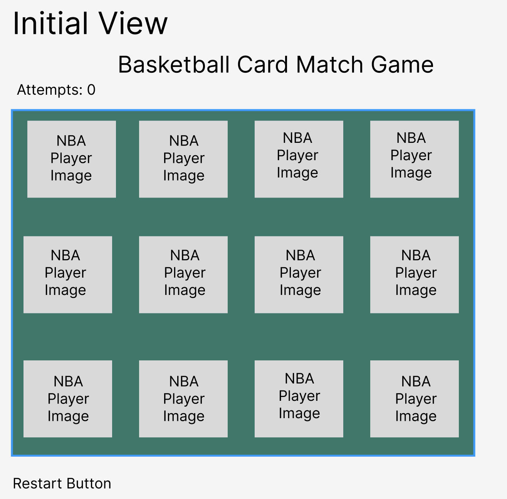
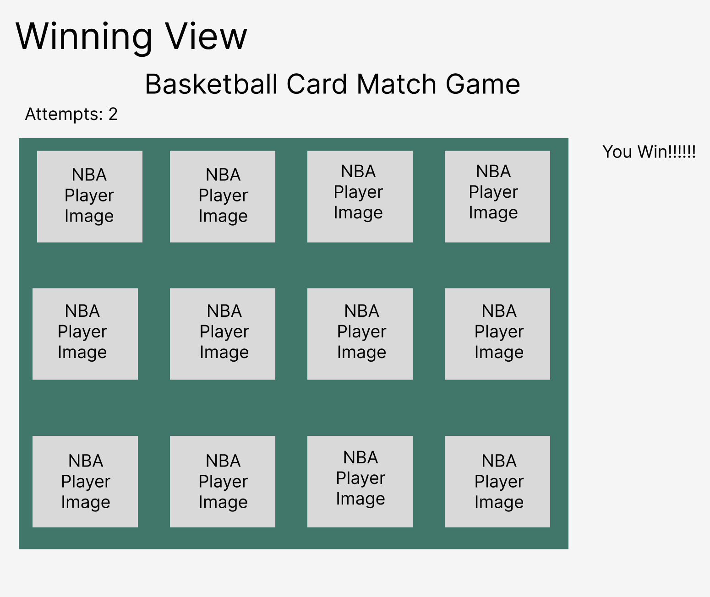
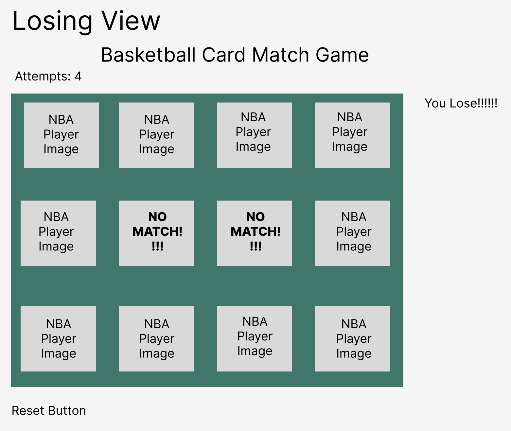

# **Basket Memory Match Game** 🏀

I created a  memory card matching game and personalized it for basketball fans! It's a game app for those who love basketball and also enjoy testing their memory skills. A player can flip two images concurrently to find 8 matching pairs. The game is designed for single players, with the goal of finding all matches before their 9 alloted attempts are up! A player must score a total of 8 points to win! The game features an NBA theme memory board that will display NBA player images. There is a total of 16 images and 8 pairs to match! The game also features audio for a winning state, losing state, and whenever there is a match and failed match.  

## Getting Started

- [Deployed Website](https://basketballmemorymatch.netlify.app)

## Wire Frames

## Technologies used

- [✔] Javascript
- [✔] HTML
- [✔] CSS

## Stretch Goals
> Establish a multiplayer state
>> Allow a game reset when refreshing the app in the browser
>>> Create difficulty round states and include a timer. ie: (Easy, Med, Hard Modes)

